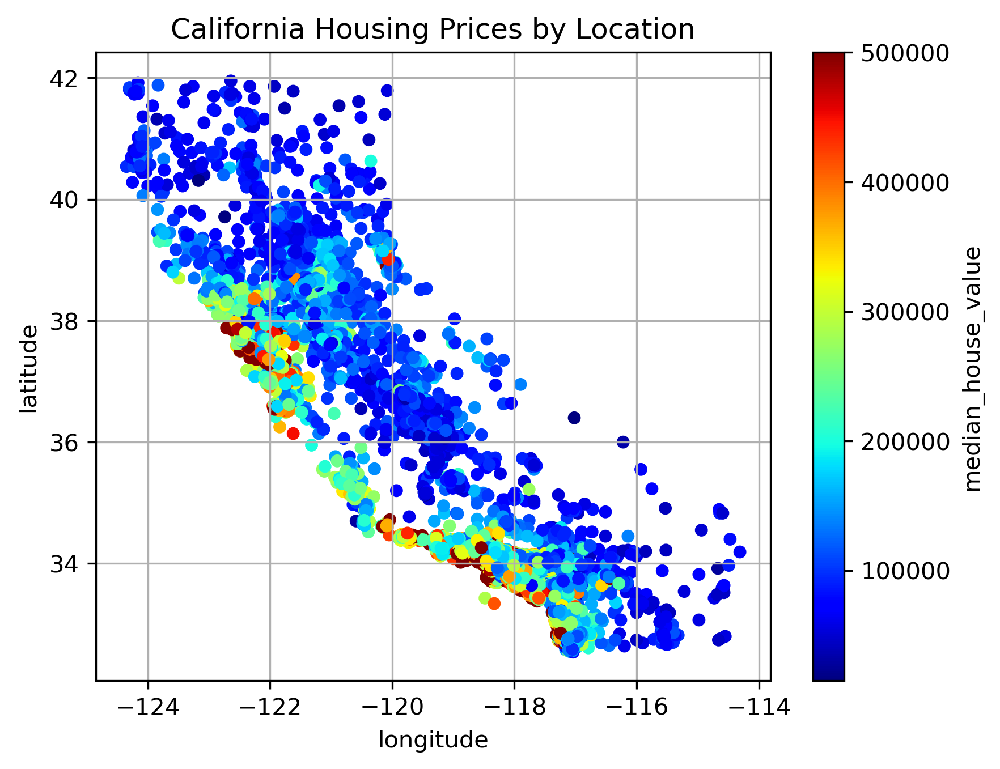
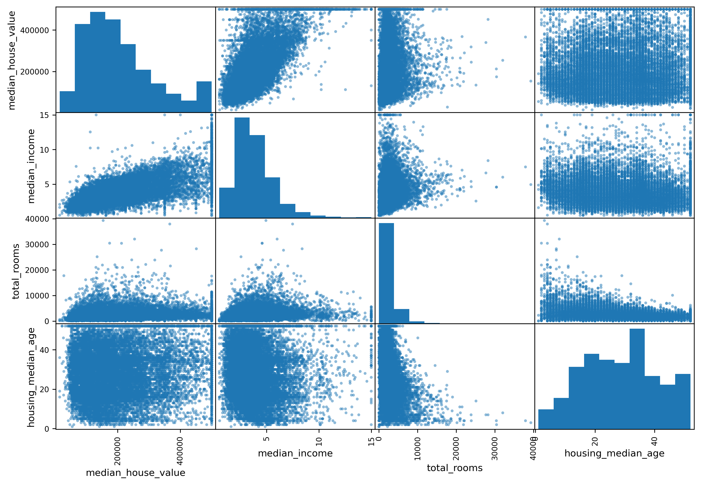
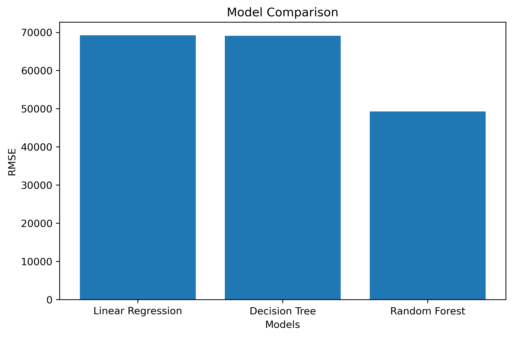

# California House Price Prediction

## Overview

This project builds an end-to-end Machine Learning pipeline to predict house prices in California using demographic, geographic, and housing-related features.

The project demonstrates the complete machine learning workflow including data preprocessing, exploratory data analysis (EDA), feature engineering, model comparison, cross-validation, model persistence, and inference using Scikit-Learn.

---

## Problem Statement

Accurately estimating house prices is an important problem in the real estate industry. This project aims to predict the median house value of California districts using features such as:

* Median Income
* Housing Median Age
* Total Rooms
* Total Bedrooms
* Population
* Households
* Latitude
* Longitude
* Ocean Proximity

---

## Dataset

Dataset Used: California Housing Dataset

### Features

| Feature            | Description                |
| ------------------ | -------------------------- |
| longitude          | Geographic longitude       |
| latitude           | Geographic latitude        |
| housing_median_age | Median age of houses       |
| total_rooms        | Total number of rooms      |
| total_bedrooms     | Total number of bedrooms   |
| population         | Population of the district |
| households         | Number of households       |
| median_income      | Median income of residents |
| ocean_proximity    | Distance from ocean        |
| median_house_value | Target variable            |

---

## Project Workflow

### 1. Data Loading

* Loaded housing dataset using Pandas
* Performed initial data inspection

### 2. Train-Test Split

Implemented Stratified Shuffle Split based on income categories to ensure balanced sampling across different income groups.

### 3. Data Preprocessing

#### Numerical Features

* Missing value imputation using Median strategy
* Standard Scaling

#### Categorical Features

* One-Hot Encoding

### 4. Pipeline Construction

Built reusable preprocessing pipelines using:

* Pipeline
* ColumnTransformer
* SimpleImputer
* StandardScaler
* OneHotEncoder

### 5. Model Training

The following regression algorithms were trained and evaluated:

* Linear Regression
* Decision Tree Regressor
* Random Forest Regressor

### 6. Model Evaluation

Evaluation Metric:

* RMSE (Root Mean Squared Error)

Model comparison was performed using:

* 10-Fold Cross Validation

### 7. Model Persistence

Saved trained model and preprocessing pipeline using Joblib.

### 8. Inference

Generated predictions on unseen data and exported results for evaluation.

---

## Technologies Used

* Python
* Pandas
* NumPy
* Scikit-Learn
* Joblib

---

## Project Structure

```text
California-House-Price-Prediction
│
├── main.py
├── compare_models.py
├── housing.csv
├── requirements.txt
├── README.md
└── .gitignore
```

---

## Model Comparison Results

### Cross Validation Results

| Model                   | Mean RMSE          |
| ----------------------- | ------------------ |
| Linear Regression       | 69204.32           |
| Decision Tree Regressor | 69123.05           |
| Random Forest Regressor | 49483.88           |

### Final Selected Model

**Random Forest Regressor**

Reason:
Random Forest achieved the lowest RMSE and generalized better than the other models.

---

## Sample Predictions

| Actual Price | Predicted Price |
| ------------ | --------------- |
| 204600       | 204614          |
| 159700       | 170215          |
| 274600       | 266749          |

---

## Screenshots

### Housing Prices Across California



---

### Feature Relationships



---

### Model Evaluation Output



---

## Key Learnings

Through this project I learned:

* End-to-End Machine Learning Workflow
* Exploratory Data Analysis (EDA)
* Stratified Sampling
* Data Preprocessing Techniques
* Feature Scaling
* One-Hot Encoding
* Scikit-Learn Pipelines
* ColumnTransformer
* Cross Validation
* Model Comparison
* Model Persistence using Joblib
* Performing Inference on New Data

---

## Future Improvements

* Hyperparameter Tuning using GridSearchCV
* Feature Importance Analysis
* Model Deployment using Flask/FastAPI
* Interactive Web Interface

---

## Author

Chinmay Mohite

Computer Science & Engineering Student | Data Science & Machine Learning Enthusiast
